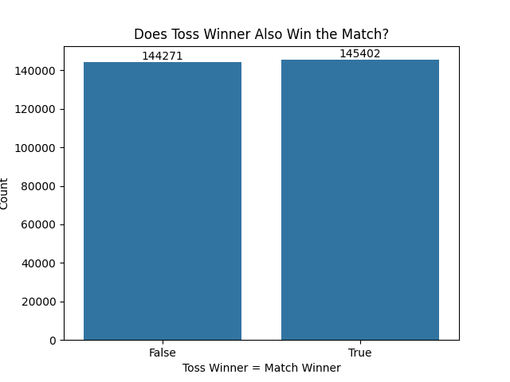
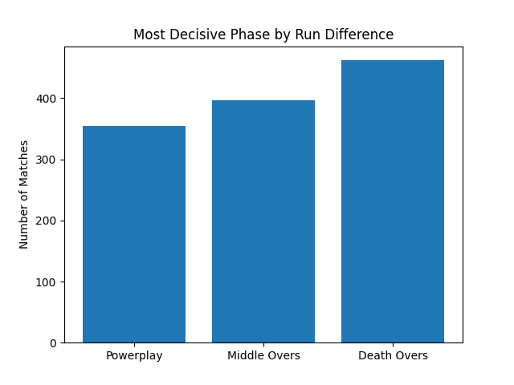
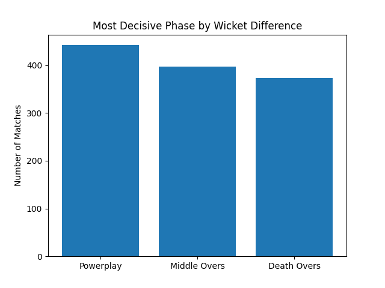
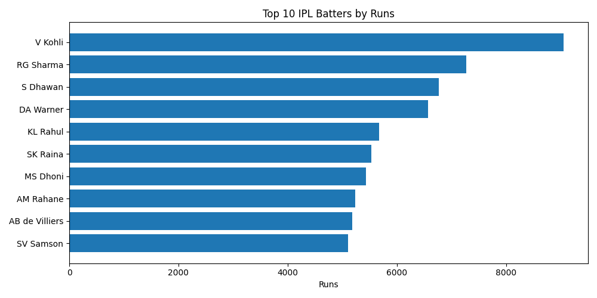
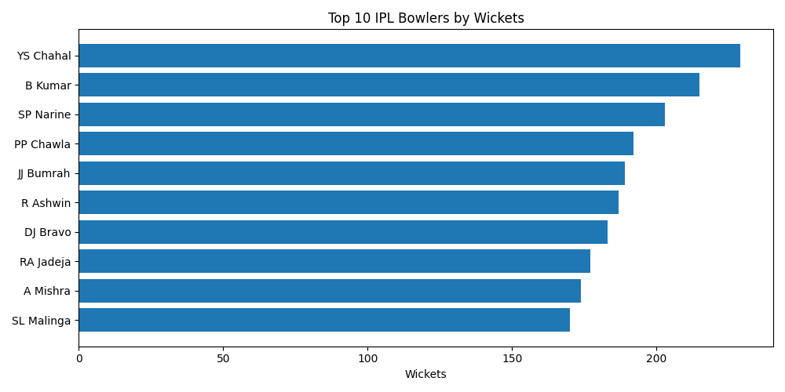
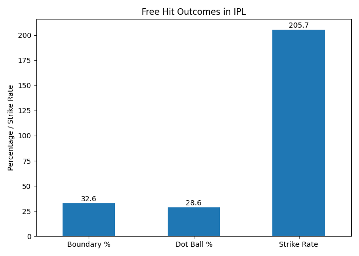
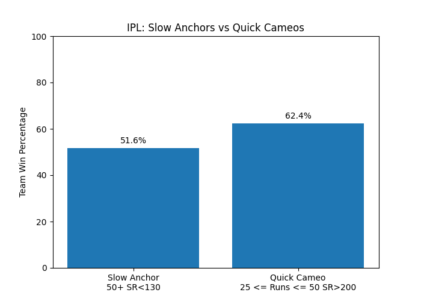

# IPL CRUNCH '26 🏏
## IPL Data Analysis Using Python and Pandas


A data analysis project exploring IPL ball-by-ball data using **Python**, **Pandas**, and **Matplotlib** to uncover match trends, player performance insights, and surprising patterns in T20 cricket.

Built as part of the IPL Crunch ’26 Wooble Hackathon Series, this project explores IPL data using Python to uncover trends, patterns, and match-winning insights.

<br>
---
<br>

## Project Overview

The Indian Premier League (IPL) generates massive ball-by-ball data every season. Every delivery contributes valuable statistical information that can be analyzed to understand:

- player performance
- team trends
- match-winning factors
- hidden cricket patterns

This project analyzes IPL data using Python and presents insights supported by numbers and visualizations.

<br>
---
<br>

## Project Objectives

This project answers the following questions:

- **Do teams that win the toss actually win more matches?**
- **Which phase impacts victory the most — Powerplay, Middle Overs, or Death Overs?**
- **Who are the top batters and bowlers across IPL seasons?**
- **What surprising patterns can be discovered from the data?**

<br>
---
<br>

## Dataset

**File:** `matches.csv`

The dataset contains IPL ball-by-ball records.

### Dataset Size

| Metric | Value |
|---|---:|
| Rows | 289,673 |
| Columns | 30 |

### Important Columns

- `match_id`
- `date`
- `season`
- `venue`
- `city`
- `team1`
- `team2`
- `toss_winner`
- `toss_decision`
- `winner`
- `innings`
- `batting_team`
- `over`
- `ball`
- `batter`
- `bowler`
- `runs_batter`
- `runs_total`
- `extras_noballs`
- `wicket_kind`

<br>
---
<br>

## Tools & Technologies

- **Python 3**
- **Pandas**
- **Matplotlib**
- **Seaborn**
- **VS Code**
- **Jupyter Notebook / Python scripts**

<br>
---
<br>

## Methodology

### 1. Data Loading

- Imported dataset using Pandas
- Verified column names
- Checked data structure

### 2. Data Cleaning

- Checked missing values
- Sorted deliveries
- Created match-level and innings-level groupings

### 3. Feature Engineering

Calculated:

- strike rate
- economy rate
- toss win indicator
- free-hit deliveries
- wickets by bowler
- phase-based scoring

### 4. Data Analysis

Performed analysis for:

- toss winner vs match winner
- phase-wise impact
- batting performance
- bowling performance
- hidden trends

### 5. Visualization

Created:

- bar charts
- count plots
- comparison charts
- summary tables

<br>
---
<br>

## Key Findings
<br>
### 1. Toss Winner vs Match Winner
<br>

| Toss Winner Also Won? | Count |
|---|---:|
| Yes | 145,402 |
| No | 144,271 |

**Win %:** ~50.2%

<br>

<br>

### Insight

Winning the toss provides only a slight advantage and does not strongly determine match outcomes.
<br>
---
<br>
### 2. Phase Impact
<br>
Death overs produced the most scoring pressure and frequently influenced final match outcomes.

<br>

<br>


<br>

### Insight

Later overs often become the deciding phase in T20 cricket.

<br>
---
<br>
### 3. Top Batters

<br>

<br>

| Batter | Runs |
|---|---:|
| Virat Kohli | 9050 |
| Rohit Sharma | 7269 |
| Shikhar Dhawan | 6769 |
| David Warner | 6567 |
| KL Rahul | 5680 |

---

### 4. Top Bowlers

<br>

<br>

| Bowler | Wickets |
|---|---:|
| YS Chahal | 229 |
| B Kumar | 215 |
| SP Narine | 203 |
| PP Chawla | 192 |
| JJ Bumrah | 189 |
<br>

---
<br>

##  Hidden Patterns & Surprising Findings
<br>
### Strike Rate on Free Hit Deliveries
<br>
People often expect a free-hit delivery to almost always result in boundaries.

Actual data showed:

| Metric | Value |
|---|---:|
| Free-hit deliveries | 1,198 |
| Strike Rate | 205.68 |
| Boundary % | 32.55% |
| Dot Ball % | 28.63% |
| Avg Runs | 2.06 |

<br>

<br>

### Insight

Free-hit deliveries are valuable, but they are not as dominant as commonly expected.

<br>
---
<br>
### Slow Anchors vs Quick Cameos
<br>
Comparison:

| Type | Innings | Team Win % |
|---|---:|---:|
| Slow Anchor (50+, SR <130) | 397 | 51.6% |
| Quick Cameo (25–50, SR >200) | 354 | 62.4% |

<br>

<br>

### Insight

Quick, aggressive batting had a stronger connection with wins than longer but slower innings.

<br>
---
<br>

## Charts Included

Project includes visualizations for:

- Toss win analysis
- Phase-wise comparison
- Top batters
- Top bowlers
- Top teams
- Free-hit analysis
- Slow anchor vs quick cameo

<br>
---
<br>

## Future Scope

This project can be extended with:

- Match winner prediction
- Player performance forecasting
- Team strategy recommendations
- Interactive dashboards
- Machine learning models

<br>
---
<br>

## Project Structure

```bash
ipl-crunch-26/
│
├── charts/
├── data
├── notebook
├── charts/
│   ├── toss_vs_match.png
│   ├── top_batters.png
│   ├── top_bowlers.png
│   ├── free_hit_outcomes.png
│   ├── slow_anchor_vs_quick_cameo.png
│   └──...
│
└── IPL_CRUNCH_26_Report.pdf
````

<br>
---
<br>

## References

* IPL Dataset (`matches.csv`)
* Python Documentation
* Pandas Documentation
* Matplotlib Documentation
* Seaborn Documentation

<br>
---
<br>

## Conclusion

This project demonstrated how Python can efficiently analyze large sports datasets and convert raw IPL data into useful insights.

The analysis highlighted:

* player consistency
* match-winning trends
* impact of strike rate
* unexpected cricket patterns

It also showed how data science can be applied effectively in sports analytics.

```
```
